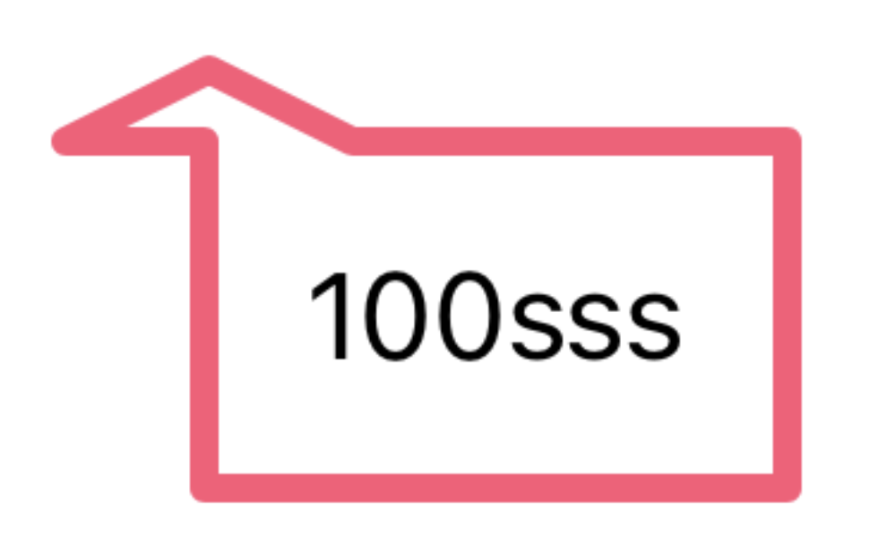
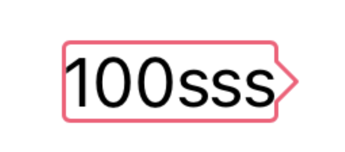

# SwiftUIToolTip


### Requirements
* iOS 14.0+
* Xcode 12.0+
* Swift 5.3


### Content
* [Documentation](#documentation)
  * [ToolTip Modifier](#toolTip_modifier)
    * [Option Description](#option_description)
      * [style](#option_style)
      * [mode](#option_mode)
      * [tailSize](#option_tailSize)
      * [tailPosition](#option_tailPosition)
      * [tailAlignment](#option_tailAlignment)
      * [cornerRadius](#option_cornerRadius)
      * [fillColor](#option_fillColor)
      * [strokeColor](#option_strokeColor)
      * [strokeStyle](#option_strokeStyle)
  * [Method](#method)
 


<a name="documentation"></a>
# Documentation

SwiftUI에서 ToolTip을 그릴려면 tail의 position이 해당 View의 rect의 x,y 값에서 어느정도 이동을 해야하며   
곡선을 그리는 계산, 그리고 border나 fill을 채우는 방식등을 직접 구현하려면 복잡합니다.   
해당 SwiftUIToolTip은 그것을 간편하게 그릴 수 있게 도와줍니다.


<a name="toolTip_modifier"></a>
## ToolTip Modifier

### ToolTipModel
| Value | Description | Default |
|:---------------------:|:------------------:|:---------:|
| **style** | ToolTip의 fill, stroke, strokeBorder style을 정한다. | 필수 |
| **mode** | ToolTip을 fixed하게 그릴 지, flexible하게 그릴지 정한다. | fixed |
| **tailSize** | ToolTip의 삼각형의 Size | zero |
| **tailPosition** | ToolTip의 삼각형의 위치 - 상/하/좌/우 | top |
| **tailAlignment** | ToolTip의 삼각형의 Alignment - 삼각형의 위치를 정한다. | center |
| **cornerRadius** | View의 CornerRadius | zero |
| **fillColor** | style이 fill일 때 적용되는 옵션 - Color를 바꾼다. | white |
| **strokeColor** | style이 stroke거나 strokeBorder일 때 적용되는 옵션 - Color를 바꾼다. | white |
| **strokeStyle** | Shape의 StrokeyStyle 옵션 | StrokeyStyle() |


<a name="option_description"></a>
## Option Description

ToolTipModel의 Option 설명

<a name="option_style"></a>
### 1. style

ToolTip의 그리는 방식을 정하는 옵션.   

기본적으로 모든 style들은 tailSize, tailPosition, movePoint, cornerRadius를 다 적용받습니다.   
하지만 fillColor, strokeColor, strokeStyle은 style에 따라 다를 수 있습니다.

| style | fillColor | strokeColor | strokeStyle |
|:---------------------:|:-------:|:-------:|:-------:|
| **fill** | O | X | X |
| **stroke** | X | O | O |
| **strokeBorder** | X | O | O |
| **fillWithStroke** | O | O | O |
| **fillWithStrokeBorder** | O | O | O |


#### 주의점
style을  strokeBorder 타입으로 설정하고 strokeStyle의 lineJoin을 miter로 설정한 경우,   
cornerRadius가 존재해도 strokeStyle의 lineWidht의 절반을 초과하지 않는 이상 cornerRadius는 0으로 들어가게 됩니다.


<a name="option_mode"></a>
### 2. mode

ToolTip을 그릴 때, 정해진 양식대로 그릴 것 인지 아니면 flexible하게 그릴 지 정하는 옵션.   

<br>

#### fixed

###### Usage examples:

```
Text("100sss")
    .padding()
    .toolTip {
        ToolTipModel(style: .strokeBorder,
                     mode: .flexible,
                     tailSize: CGSize(width: 40, height: 10),
                     tailPosition: .top,
                     tailAlignment: .leading,
                     cornerRadius: 2,
                     fillColor: .blue,
                     strokeColor: .pink.opacity(0.8),
                     strokeStyle: StrokeStyle(lineWidth: 4,
                                              lineCap: .round,
                                              lineJoin: .round))
    }
```

| mode | draw |
| --- | --- |
| **fixed** (default) |  |
| **flexible** |  |

<br>


<a name="option_tailSize"></a>
### 3. tailSize

삼각형의 Size 옵션


<a name="option_tailPosition"></a>
### 4. tailPosition

삼각형의 배치를 정하는 옵션

| tailPosition | draw |
|:-------:|:-------:|
| **top** |  |
| **leading** |  |
| **trailing** |  |
| **bottom** |  |


<a name="method"></a>
## Method

* **`func toolTip(style: ToolTipShapeStyle,
                     tailSize: CGSize = .zero,
                     tailPosition: TailPosition = .top,
                     movePoint: CGFloat = .zero,
                     cornerRadius: CGFloat = .zero,
                     fillColor: Color = .white,
                     strokeColor: Color = .white,
                     strokeStyle: StrokeStyle = StrokeStyle()) -> some View`**


   설정한 parameters에 따라 toolTip을 그립니다.


   ##### Usage examples:

   ```
   Text("나는 문어 대왕 문어")
       .padding(.all, 8)
       .toolTip(style: .fillWithStroke,
                tailSize: CGSize(width: 20, height: 14),
                tailPosition: .top,
                movePoint: 0,
                cornerRadius: 6,
                fillColor: .white,
                strokeColor: .blue,
                strokeStyle: StrokeStyle(lineWidth: 2,
                                         lineCap: .round,
                                         lineJoin: .round))
   ```


   

  
* **`func toolTip(_ model: @escaping () -> ToolTipModel) -> some View`**

   closure에 구현한 model을 이용해 toolTip을 그립니다.

   ###### Usage examples:

   ```
   Text("나는 문어 대왕 문어")
       .padding(.all, 8)
       .toolTip {
           ToolTipModel(style: .strokeBorder,
                        tailSize: CGSize(width: 20, height: 14),
                        tailPosition: .bottom,
                        movePoint: 30,
                        cornerRadius: 10,
                        strokeColor: .orange,
                        strokeStyle: StrokeStyle(lineWidth: 2,
                                                 lineCap: .round,
                                                 lineJoin: .round))
       }
   ```

   
